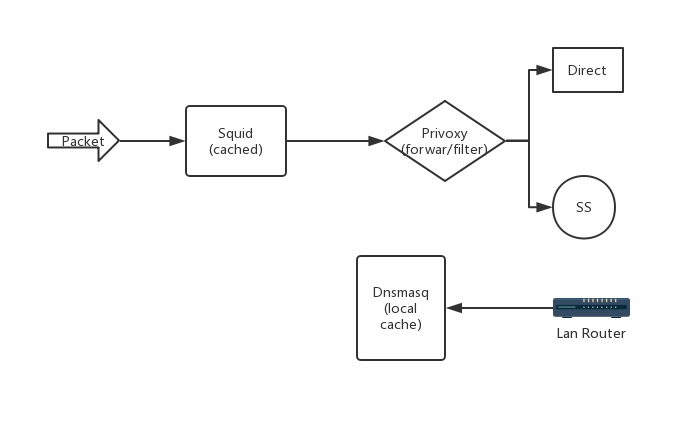

# Cache and Proxy in Lan

packet -> squid -> privoxy -> shadowsocks

Here squid is used for http cache, and privoxy is used for autoproxy and webcontent filtering.
To accelerate the speed of dns query, dnsmasq is used, and it can also play as dhcp server on raspberrypi with wireless AP.

