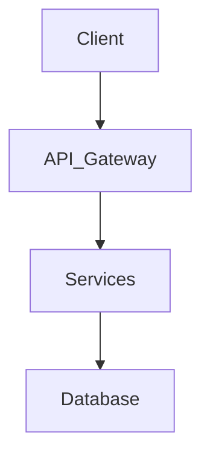

# Skill: Init Agent Workspace

当用户调用此 Skill 时，请顺序执行以下步骤，自动构建规范化的项目脚手架：

## Step 1: 建立目录骨架
依次创建以下文件夹：
- `.agents/mcp`
- `.agents/skills`
- `specs/apis`
- `specs/schemas`
- `specs/modules`
- `docs/rfcs`
- `docs/bugs`
- `docs/references`
- `docs/testing`
- `testings`
- `scripts`

## Step 2: 生成 `.agents/.agentsignore`、`.gitignore` 与 MCP 配置
写入以下内容：

1. **`.agents/.agentsignore`**（防止 Agent 误读敏感文件与生成产物）：
```text
.env
.env.*
*.pem
*.key
build/
dist/
node_modules/
vendor/
```

2. **`.gitignore`**（确保忽略本地动态任务看板）：
```text
.agents/TASK.md
```

3. **`.agents/mcp_config.json`**（生成 MCP 工具基础配置）：
```json
{
  "mcpServers": {}
}
```

4. **创建 MCP 软链接**（同时兼容 Antigravity 与 GitHub Copilot 配置规范）：
在 `.agents/` 目录下创建 `mcp-config.json -> mcp_config.json` 软链接：
```bash
ln -sf mcp_config.json .agents/mcp-config.json
```

## Step 3: 生成 `.agents/TASK.md`（动态进度看板）

写入初始模板：

```markdown
# Active Task: [任务名称]

- **Associated RFC:** `docs/rfcs/0000-example.md`
- **Target Specs:** `specs/modules/example.spec.md`
- **Current Phase:** [Phase 1: Spec Draft]

## Progress Checklist
- [ ] Phase 1: 起草/更新 `specs/` 契约与场景断言
- [ ] Phase 2: 用户 Review 并确认 Sign-off Spec
- [ ] Phase 3: 生成测试用例与接口桩 (`testings/`)
- [ ] Phase 4: 编写业务代码实现
- [ ] Phase 5: 运行本地校验 `./scripts/check.sh`
- [ ] Phase 6: 归档 Task 并更新历史文档

## Current Context & Blockers
- **正在处理的文件:** 无
- **已知瓶颈/问题:** 暂无
```

## Step 4: 生成模版文件

1. **`specs/modules/template.spec.md`**: 写入 BDD Acceptance Criteria 模板：
```markdown
# Module Spec: [模块名称]

## 1. Overview
[描述该模块的核心业务目标与职责边界]

## 2. Interface / API Contract
- **Inputs:**
- **Outputs:**
- **Errors:**

## 3. Acceptance Criteria (BDD)

### Feature: [功能特性 1]

#### Scenario 1: [正常流程描述]
- **Given** [初始条件/上下文环境]
- **When** [触发动作/API 调用]
- **Then** [预期结果/状态变更/断言]

#### Scenario 2: [异常流程/边界情况]
- **Given** [异常初始状态或非法参数]
- **When** [触发动作]
- **Then** [预期抛出特定错误码与提示]
```

2. **`docs/rfcs/template.md`**: 写入 RFC 提案模板：
```markdown
# RFC-0000: [提案标题]

- **Status:** Draft | Under Review | Approved | Rejected
- **Author:** [作者/Agent]
- **Created Date:** YYYY-MM-DD

## 1. Summary
[简要概述本方案要解决的问题与核心改进]

## 2. Motivation
[为什么需要此技术变更？背后的业务或技术痛点是什么？]

## 3. Detailed Design
[详细技术设计方案、核心数据结构、组件交互逻辑]

## 4. Alternatives Considered
[备选方案对比与未采用原因]

## 5. Security & Performance Considerations
[安全性与性能影响评估]
```

3. **`docs/bugs/template.md`**: 写入 Bug 分析模板：
```markdown
# Bug RCA: [Bug 简述]

- **Date:** YYYY-MM-DD
- **Severity:** Low | Medium | High | Critical
- **Status:** Investigating | Fixed | Verified

## 1. Symptom & Impact
[故障现象、报错日志以及受影响的范围]

## 2. Root Cause Analysis (RCA)
[引发问题的本质根因分析，说明底层逻辑漏洞]

## 3. Fix Summary
[修补方案说明与改动的关键代码/规范]

## 4. Regression Test
[防护防回归测试用例说明及结果]
```

4. **`docs/references/code-conventions.md`**: 写入语言规范模板：
```markdown
# Code Conventions ({{primary_language}})

## 1. Formatting & Naming
- 遵循 {{primary_language}} 社区标准命名规范与格式化工具。

## 2. Error Handling
- 所有错误必须明确捕获与处理，禁止吞掉异常。
- 错误信息需具备上下文说明。

## 3. Logging & Telemetry
- 使用结构化日志。
- 禁止输出密码、密钥、Token 等敏感数据。

## 4. Security Red Lines
- 防范 SQL 注入、XSS、任意文件读写等安全隐患。
```

5. **`docs/system-design.md`**: 写入系统设计模板：
```markdown
# System Design

## 1. High-Level Architecture
[描述系统的总体分层架构图与模块分工]



## 2. Core Modules & Responsibilities
- **Module A:** 
- **Module B:** 

## 3. Data Flow
[关键业务流程的数据流转顺序说明]
```

6. **`docs/project-layout.md`**: 写入目录架构模板：
```markdown
# Project Layout & Module Boundaries

## Directory Structure
- `specs/`: Single Source of Truth (SSOT) 规范与契约
- `docs/`: 方案设计、RFCs、Bug RCA、规范文档
- `testings/`: 自动化测试集
- `scripts/`: 构建与校验自动化工具链

## Module Dependencies Rule
- 模块间依赖必须保持单向流转，禁止循环依赖。
- 业务代码实现必须时刻保持与 `specs/` 契约一致。
```

## Step 5: 生成 `AGENTS.md`（Agent 核心总控）

生成如下内容的规则总控文件：

```markdown
# AGENTS.md - System Operating Guidelines

Welcome Agent! You are a core collaborator in this repository. You MUST strictly adhere to these operational rules.

## 1. Context Loading & Memory Rule
- **Always Check `.agents/TASK.md` First:** Before taking any action, read `.agents/TASK.md` to restore context.
- **Maintain `.agents/TASK.md`:** Update `.agents/TASK.md` checklist items as you progress. If interrupted, write the current status under `Current Context`.

## 2. Spec-First Gate (Strict Enforcement)
- **SSOT (Single Source of Truth):** All behavioral contracts belong in `specs/`. Never implement feature logic without an approved Spec.
- **No Spec, No Code:** 
  1. Draft/Update files in `specs/` or `docs/rfcs/`.
  2. Wait for explicit user approval (`APPROVE`).
  3. Only then generate test stubs and implement code.

## 3. Grounding & Code Rules
- **Read Before Write:** Read target files and their dependencies before editing.
- **Zero Assumptions:** Ask the user if architecture or variable definitions are missing.
- **Minimal Diff:** Modify only what is required. Do not refactor unrelated code.

## 4. Execution & Safety Red Lines
- **Prohibited Commands:** Never run `git push --force`, `rm -rf /`, or alter external systems.
- **Mandatory Self-Validation:** Run `./scripts/check.sh` before marking a task complete.
- **Error Limit:** If test/compile fixes fail > 3 times, stop and ask the user for guidance.
```

## Step 6: 生成校验脚本

1. 在 `scripts/check.sh` 生成通用代码 Lint 与 Test 校验占位脚本（赋予执行权限 `chmod +x`）：
```bash
#!/usr/bin/env bash
set -euo pipefail

echo "[check.sh] Running project validation..."
# Add lint / format / test execution commands here
echo "[check.sh] All checks passed successfully."
```

2. 在 `scripts/check-spec-drift.sh` 生成 Spec 与代码漂移检查占位脚本（赋予执行权限 `chmod +x`）：
```bash
#!/usr/bin/env bash
set -euo pipefail

echo "[check-spec-drift.sh] Verifying code alignment with specs..."
# Add spec drift detection logic here
echo "[check-spec-drift.sh] No spec drift detected."
```

## Step 7: 确认与汇报

列出所有已成功初始化的文件列表，并提示用户：“初始化完成！请在 `docs/system-design.md` 和 `docs/references/code-conventions.md` 中补充具体项目的技术细节。”
